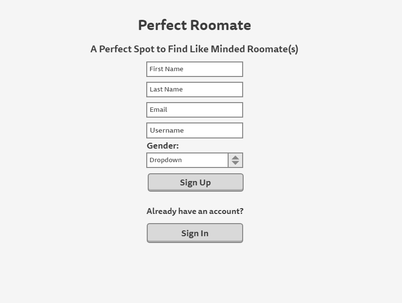
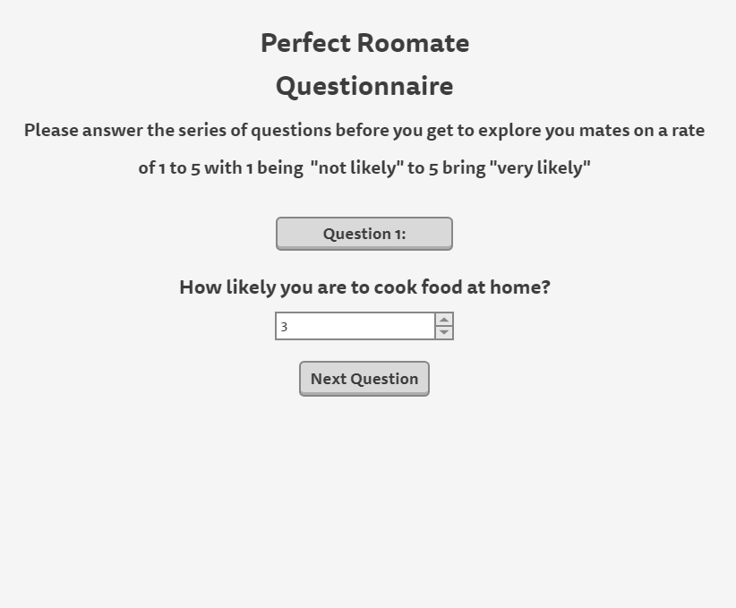
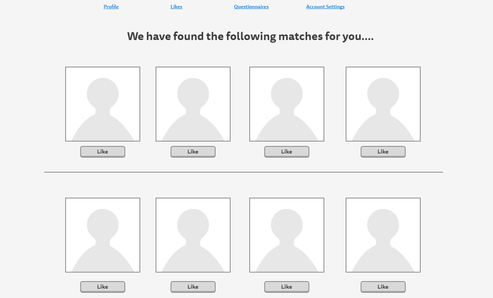
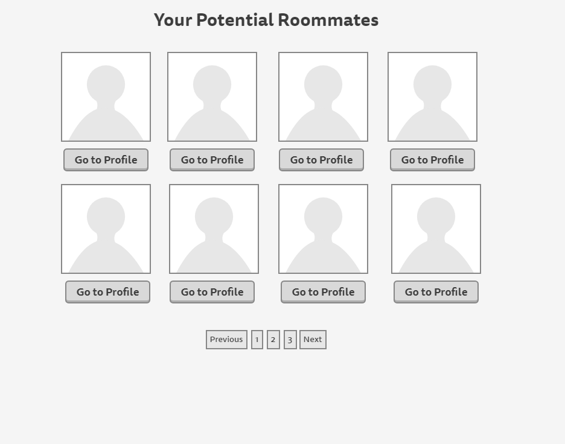
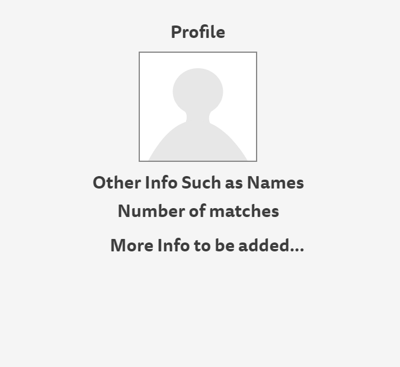
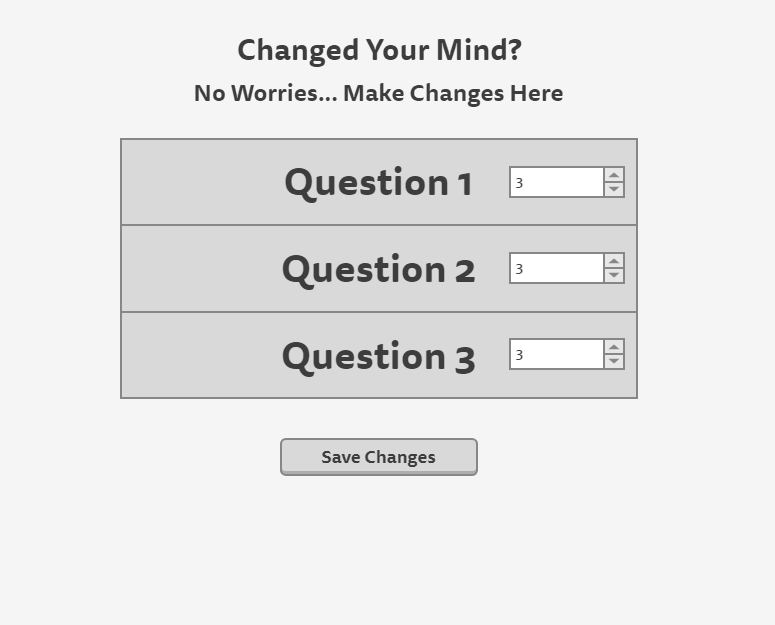
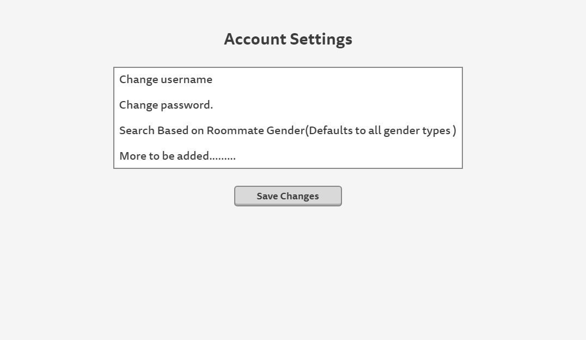

### The culmination of the small node.js/express.js applications on my GitHub

# Perfect Roommate

## Overview

## Breif Project Description.

First year in college and dorming? Well, you better have roommate(s) with similar interests. Otherwise, it is going to be another level of stress /anxiety added to your newly started academic career. That is where you can count on Perfect Roommate.

Perfect Roommate is a web applcation where you will sign up for an account. Upon signing up, it will ask you some additional questions. Then there the magic happens!!! It will find you roommates based on similar interests.

Now that you have a like minded person with you, tackling your academic career would be much more exciting and easier.  

## Data Model

The application will store **Users**, list of questions(we will call it **Questionnaire**) for the user to answer upon singing up and a list (we will call it **UserInfo**) that has a user reference, list of the questionnaires, the user's answers to the questionnaires and a *rank* to calculate the matches with other users.

### User 
- a user should have login info (first name, last name, email, gender, bithday, password hash etc.)
- a list of users(**matches**) with similar interests (could be empty).

### Questionnaire
- contains list of questions to be asked to the user.

### UserDetail
- contains list of users.
- each user's answers to the questionnaires.
- a rank for the user to calculate matches.

An Example of a **User**:

```javascript
{
    firstName: "Mir",
    lastName: "Ahmed",
    username: "mirahmed65(has to be unique)",
    hash: // a password hash,
    matches: [User]// an array of refereces to other users.
}
```

An Example of **Questionnaire**:

```javascript
{
    questionnaire: [
        'How likely you are to cook food at home?',
        'How likey you are to study at library rather than in your dorm?',
        '..........'
        ]
}
```

An Example of **UserDetail**:

```javascript
{
    user: // a reference to a user
    answers: [5, 6, 4, 5] // the answers to the questions(questions are based on rate of 1 to 5)
    rank: // a rank assigned to the user based on the answers.
}
```

## [Link to Commented First Draft Schema](db.js) 

## Wireframes

/login - page for login or sign up



/questionnaires - page for showing all the questions



/matches - page for showing all the macthes found



/likes - page for showing roommate(s) a user liked



/profile - page for showing a user's profile



/changequestion - page for chnaging answer to questionnaires



/settings - page for account settings



## Site map

The homepage is sign up/login page (**/login**). Upon singing up or logging in, the user will be asked a series of qiestions in the **/questionnaires** page. After the user answers all the questions, the web application will use its internal mechanism to calculate the best matches for roommate(s) and display them on the **/matches** page. The user can add however many roommates he/she wants and can later see the his/her likes on the **/likes** page. If anytime the user wants to change answer(s) to the questionnaires, it can be done by accessing the **/changequestion** page. The user can also he his profile and summary of things (to be added as the project progresses) on the **/profile** page. From this page, the user can change his/her profile picture(this functionalilty is to be added only if time allows). Finally from the **/settings** page, the use can change his/her login credentials (again, this will be added only if time allows). 

## User Stories or Use Cases

1. as non-registered user, I can register a new account with the site
2. as a user, I can log in to the site
3. as a user, I can have access to the questionnaires and answer them
4. as a user, I can view all the potential roommate(s) that matches with me.
5. as a user, I can like any potential roommate.
6. as a user, I can see the potential roommate(s) that I liked.
7. as a user, I can dislike a roomate from my likes.
8. as a user, I can make changes to the answers of the questionnaires.
9. as a user, I can view my profile and make change my profile picture.
10. as a user, I can change my login credentials.

## Research Topics

* Integrate user authentication
    * I'm going to be using passport for user authentication
    * user authentication is the key factor of this web applcation.
    * without user authentication, the user cannot experience the functionalilies of the application.
    * may add registration with third party app only if time allows.
* Gulp Task Runner
    * to minify and concatenate client side javascript and css files.
    * using a CSS preprocessor called **less** and run it using gulp.
    * never used a task runner, this seems like a good way to get started.
* CSS framework (Bootsrap)
    * use the latest version of bootsrap to minimize the time to style webpages.
    * Have experience using this framework.
    * I have checked sample websites that used bootsrap and they look elegant. I want to make mine look elegant as well without writing much css.


## [Link to Initial Main Project File](app.js) 

## Annotations / References Used

1. [passport.js authentication docs](http://passportjs.org/docs) - (add link to source code that was based on this)
2. [tutorial on bootstrap](https://v4-alpha.getbootstrap.com/getting-started/introduction/) - (add link to source code that was based on this)
3. [tutorial on less](http://lesscss.org/) - (add link to source code that was based on this)
4. [tutorial on Grunt to minify javascript](https://github.com/gruntjs/grunt-contrib-uglify) - (add link to source code that was based on this)
5. [tutorial on Grunt to complie .less files](https://github.com/gruntjs/grunt-contrib-less) - (add link to source code that was based on this)
